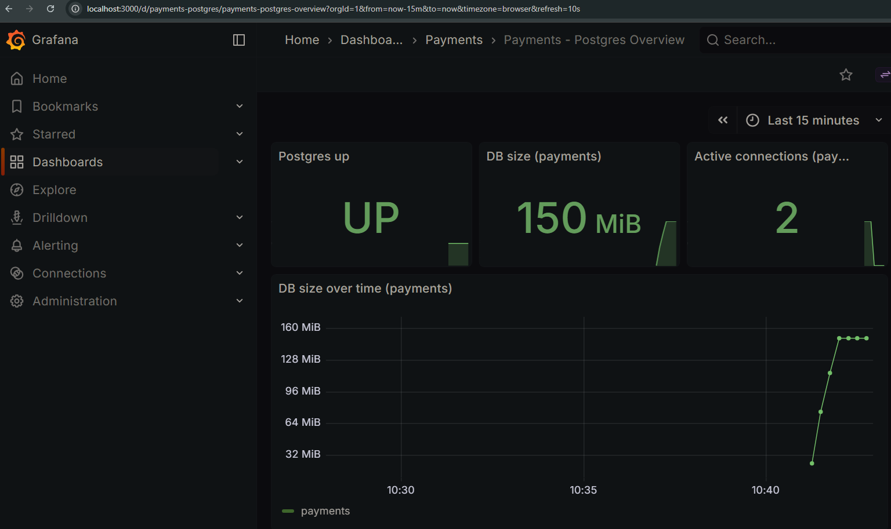

### Requisitos

- Docker
- Docker Compose (plugin `docker compose`)
- Bash (para ejecutar `./scripts/bootstrap.sh`)
---

### Ejecución

Desde la **raíz del repo**:

```bash
docker compose -f compose/docker-compose.yml up -d && ./scripts/bootstrap.sh
```

Esto levanta todos los servicios y luego ejecuta el bootstrap para preparar el esquema/datos y disparar el ETL.

---

### Acceso rápido (UI y monitoreo)

- **Grafana**: `http://localhost:${GRAFANA_PORT:-3000}`
  - Credenciales por default: `admin / admin`
  - Dashboard precargado: carpeta `Payments` → `Payments - Postgres Overview`
- **Prometheus**: `http://localhost:${PROMETHEUS_PORT:-9090}`
  - Targets: `http://localhost:${PROMETHEUS_PORT:-9090}/targets`
  - Alertas: `http://localhost:${PROMETHEUS_PORT:-9090}/alerts`
- **RabbitMQ (management UI)**: `http://localhost:${RABBITMQ_MGMT_PORT:-15672}`
  - Credenciales por default: `admin / admin`

Durante la primera ejecución, el worker genera hasta `STAGE_TARGET_TXN` transacciones. Para ver progreso:

```bash
docker logs -f payments-worker
```

---

### Configuración (.env)

Para usar variables personalizadas, crea un `.env` en la raíz:

```bash
cp .env.example .env
```

El `docker-compose.yml` usa variables con defaults (ej: `POSTGRES_USER`, `POSTGRES_DB`, `GRAFANA_PORT`, `STAGE_TARGET_TXN`, etc.).

---

### ¿Qué hace `bootstrap.sh`?

- **Espera a PostgreSQL** (healthcheck OK)
- **Ejecuta `db/seed.sql`** (esquema + datos base de `account/merchant/terminal` + particiones)
- **Espera a RabbitMQ**
- **Dispara el pipeline ETL** publicando `stage` a la cola (`scripts/queue_kickoff.sh`)

`seed.sql` se ejecuta **solo por bootstrap** (no por initdb), para evitar duplicación.

Si vuelves a correr `./scripts/bootstrap.sh`, el script detecta si ya hay datos en `account` y **salta** `seed.sql` para no duplicar. Para un reset completo, usa `docker compose -f compose/docker-compose.yml down -v`.

---

### Servicios levantados

- **PostgreSQL**: `localhost:${POSTGRES_PORT:-5432}`
- **RabbitMQ (management UI)**: `http://localhost:${RABBITMQ_MGMT_PORT:-15672}` (user/pass por default: `admin/admin`)
- **postgres-exporter**: `http://localhost:${POSTGRES_EXPORTER_PORT:-9187}/metrics`
- **Prometheus**: `http://localhost:${PROMETHEUS_PORT:-9090}`
- **Grafana**: `http://localhost:${GRAFANA_PORT:-3000}` (user/pass por default: `admin/admin`)

---

### ETL (RabbitMQ + Worker)

- Cola: `etl_queue`
- Flujo: `stage → clean → agg`
- `worker.py` consume mensajes y ejecuta el script correspondiente.
- `stage.py` genera transacciones sintéticas hasta `STAGE_TARGET_TXN` (default: **1,000,000**) en chunks (`STAGE_CHUNK_SIZE`).

---

### Observabilidad (Prometheus + Grafana)

- Prometheus scrapea `postgres-exporter` y carga reglas desde `prometheus/alerts.yml`.
- Grafana se provisiona automáticamente (datasource + dashboard) desde `grafana/provisioning/`.

---

### Alertas

- Reglas en `prometheus/alerts.yml`
- Documentación: `docs/alert.md`

---

### Backups / Restore

- **Automático**: servicio `backup` genera dumps periódicos en `./backups`.
- **Manual**:
  - `./scripts/backup.sh`
  - `./scripts/restore.sh`
  - `./scripts/verify_restore.sh`

Documentación: `docs/restore.md`

---

### Consultas, planes, tuning y benchmark

- **Integridad + EXPLAIN**: `docs/plans.md`
- **Tuning + parámetros**: `docs/tuning.md`
- **Benchmark mínimo (`pgbench`)**: `docs/bench.md`

---

### Estructura del repo

```
payments-platform/
├─ compose/
│  └─ docker-compose.yml
├─ db/
│  ├─ seed.sql
│  ├─ postgresql.conf
│  └─ migrations/
│     └─ README.md
├─ etl/
│  ├─ Dockerfile
│  ├─ worker.py
│  ├─ stage.py
│  ├─ clean.py
│  └─ agg.py
├─ grafana/
│  ├─ dashboards/
│  └─ provisioning/
├─ prometheus/
│  ├─ prometheus.yml
│  ├─ alerts.yml
│  └─ postgres_exporter.yml
├─ jobs/
│  └─ backup_loop.sh
├─ scripts/
│  ├─ bootstrap.sh
│  ├─ bootstrap.py
│  ├─ queue_kickoff.sh
│  ├─ backup.sh
│  ├─ restore.sh
│  └─ verify_restore.sh
├─ backups/
├─ docs/
│  ├─ grafana-dashboard.json
│  ├─ plans.md
│  ├─ tuning.md
│  ├─ bench.md
│  ├─ alert.md
│  └─ restore.md
├─ .env.example
└─ README.md
```

---

### Evidencia (Grafana)

La siguiente captura muestra el dashboard de Grafana funcionando. Se alcanza a ver cómo el tamaño de la base de datos sube durante la generación/carga de transacciones y después se estabiliza.



---

### Comentario final

En general el proyecto me pareció entretenido. Tuve que ponerme a revisar y aprender RabbitMQ, Prometheus y Grafana porque no me había tocado usarlos antes; mi experiencia previa había sido más con automatización/CI/CD tipo GitHub Actions/Kafka/Datadog y scripts de despliegue.

Eso fue lo que me hizo demorarme un poco más en poder sacar el proyecto. Siento que es una prueba extensa a pesar de trabajar con datos sintéticos, pero en general me gustó mucho y lo disfruté.

También creo que hay puntos de mejora (sobre todo si esto fuera para algo más “real” y no una prueba rápida), por ejemplo:
- formalizar migraciones (Flyway) en lugar de depender de un `seed.sql` completo,
- separar mejor responsabilidades del worker (reintentos, DLQ, métricas del pipeline),
- y usar servicios administrados para colas/observabilidad en un entorno cloud para reducir carga operativa. Aunque esta sugerencia depende de si se cuenta con recursos on premise.

Pido disculpas por la tardanza: tuve relativamente poco tiempo para poder realizar esta prueba por la carga laboral de tiempo completo y porque también estoy cursando una maestría. Hice mi mejor intento dadas las limitaciones de tiempo que tuve. Claro que es mejorable, todo es mejorable.
